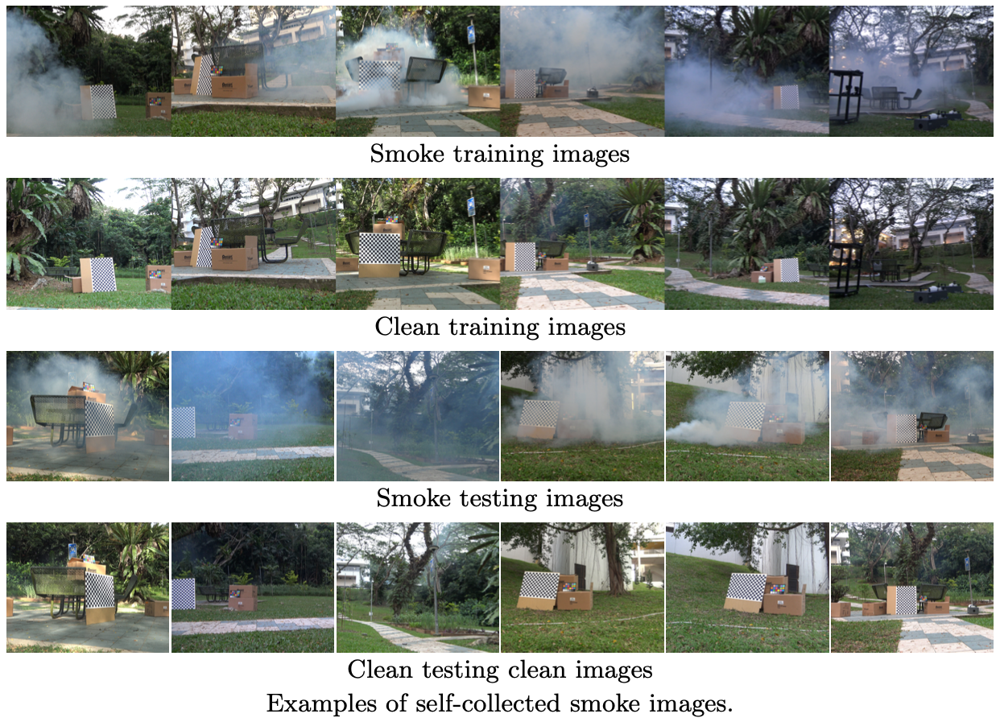

# FogRemoval [ACCV'2022]
## Introduction
> [Structure Representation Network and Uncertainty Feedback Learning for Dense Non-Uniform Fog Removal](https://openaccess.thecvf.com/content/ACCV2022/papers/Jin_Structure_Representation_Network_and_Uncertainty_Feedback_Learning_for_Dense_Non-Uniform_ACCV_2022_paper.pdf)
> Asian Conference on Computer Vision (ACCV'2022)

[[Paper Link]](https://openaccess.thecvf.com/content/ACCV2022/papers/Jin_Structure_Representation_Network_and_Uncertainty_Feedback_Learning_for_Dense_Non-Uniform_ACCV_2022_paper.pdf)
[[Supplementary]](https://openaccess.thecvf.com/content/ACCV2022/supplemental/Jin_Structure_Representation_Network_ACCV_2022_supplemental.pdf)
[](https://arxiv.org/pdf/2210.03061.pdf)
[[Poster]](https://www.dropbox.com/s/f3qjxx9jf3o7b6j/0393_poster.pdf?dl=0)
[[Slides]](https://www.dropbox.com/s/f3qjxx9jf3o7b6j/0393_poster.pdf?dl=0)

### Abstract
Few existing image defogging or dehazing methods consider dense and non-uniform particle distributions, which usually happen in smoke, dust and fog. Dealing with these dense and/or non-uniform distributions can be intractable, since fog's attenuation and airlight (or veiling effect) significantly weaken the background scene information in the input image. To address this problem, we introduce a structure-representation network with uncertainty feedback learning. Specifically, we extract the feature representations from a  pre-trained Vision Transformer (DINO-ViT) module to recover the background information. To guide our network to focus on non-uniform fog areas, and then remove the fog accordingly, we introduce the uncertainty feedback learning, which produce the uncertainty maps, that have higher uncertainty in denser fog regions, and can be regarded as an attention map that represents fog's density and uneven distribution. Based on the uncertainty map, our feedback network refine our defogged output iteratively. Moreover, to handle the intractability of estimating the atmospheric light colors, we exploit the grayscale version of our input image, since it is less affected by varying light colors that are possibly present in the input image. The experimental results demonstrate the effectiveness of our method both quantitatively and qualitatively compared to the state-of-the-art methods in handling dense and non-uniform fog or smoke.

## Datasets
### 1. [Smoke Dataset](https://www.dropbox.com/sh/wg38snebqnw18l4/AAArLgzWBoA6Zf_Nhzn5elgRa?dl=0)
```
${FogRemoval}
|-- Dataset_day
    |-- Smoke
      |-- train (110 pairs)
         |-- hazy  
         |-- clean
      |-- test (12 pairs)
         |-- hazy  
         |-- clean  
```
<p align="left">
  
</p>

[Ours Results](https://www.dropbox.com/sh/d1xpyqav1uoqcfy/AABAgO6MoohQ8yV02aRZmU66a?dl=0)

### 2. [Fog Cityscapes](https://www.dropbox.com/sh/mc5ffqsnt4v51tb/AAA34D0md0arAtabonmVVn0Oa?dl=0)
```
${FogRemoval}
|-- Dataset_day
    |-- Cityscapes
      |-- disparity 
      |-- leftImg8bit 
      |-- train (2,975 pairs)
         |-- hazy
         |-- clean 
      |-- test (1,525 pairs)
         |-- hazy  
         |-- clean 
      |-- generate_haze_cityscapes.m
```
      
Run the Matlab code to generate Synthetic Fog Cityscapes pairs:
```
Cityscapes/generate_haze_cityscapes.m
```
<p align="left">
  
</p>

If smoke data is useful for your research, please cite our paper. 
```

```

